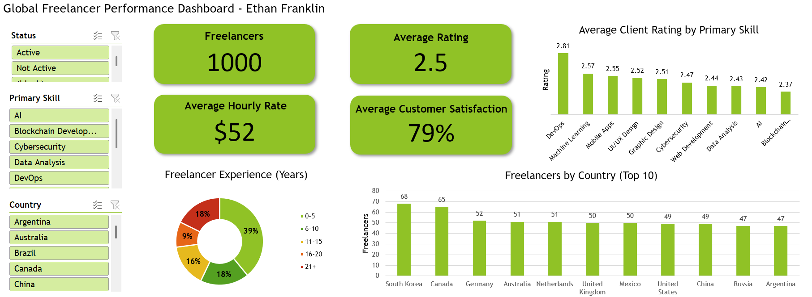

# Global Freelancer Performance Dashboard


<p align="center">
  
</p>


## Overview

This Excel-based interactive dashboard analyzes a dataset of 1,000 freelancers, focusing on performance metrics such as client ratings, hourly rates, experience levels, geographic distribution, and primary skills.

## Project Goals
- Demonstrate effective data cleaning using Excel formulas.
- Create dynamic, interactive visualizations with pivot tables, charts, and slicers.
- Provide clear, at-a-glance KPIs for freelancer platform performance analysis.

### Key Insights
- DevOps specialists have the highest average client rating (2.81 out of 5).
- 39% of freelancers are juniors (0–5 years of experience).
- South Korea leads in freelancer count (68), followed by Canada (65).
- Overall average rating is 2.5; average hourly rate is $52; average client satisfaction is 79%.

## Sheets:
- **raw_data**  
  Original imported Kaggle Data
- **clean_data**  
  Processed and standardized version used as the source table for pivots and dashboard.
- **Pivots**  
  Helper sheet containing all pivot tables (counts, averages, distributions).
- **Dashboard**  
  Main sheet with KPIs, charts, and slicers.

### Main Cleaning Steps

1. **Remove titles (Mr., Mrs, etc) from names Column**  
   Keep name only: ```=TEXTAFTER(B2, ". ", )```  
   
2. **Normalize Gender Column**  
   "Female" or "Male": ```=IF(LEFT(C2,1)="f", "Female", "Male")```  

3. **Create Experience Buckets Column**  
   Group individual years into ranges: ```=IFS(H2<=5, "0-5", H2<=10, "6-10", H2<=15, "11-15", H2<=20, "16-20", H2>20, "21+")```  

4. **Clean Hourly Rate Column**  
   Remove $: ```=SUBSTITUTE(J7, "$", " ")```  
   Remove USD: ```=TEXTAFTER(J3, " ")```  
   - Clean number only (formatted as currency)

5. **Convert Client Satisfaction To %**  
   Turns plain number into decimal:  ```=M35/100```  
   - Formatted as percentage


## Tools & Techniques Used

- Excel Tables for dynamic ranges
- Pivot Tables & Pivot Charts
- Slicers for filtering
- Formula-based data cleaning


## Future Improvements

- Add more slicers (Language, Gender, Age group)
- Use Power Query for more scalable cleaning
- Create a Power BI version for online sharing
     
